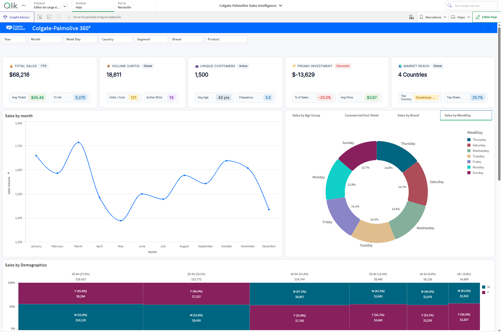
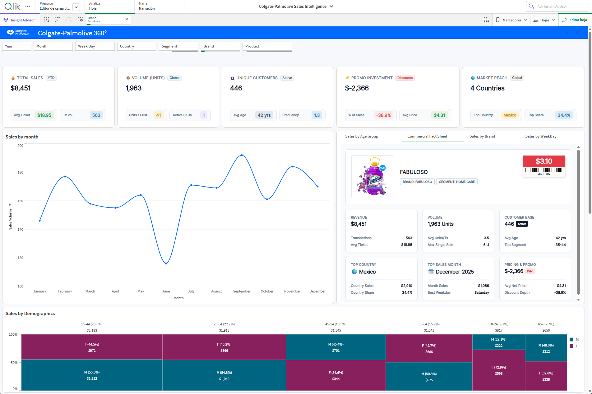
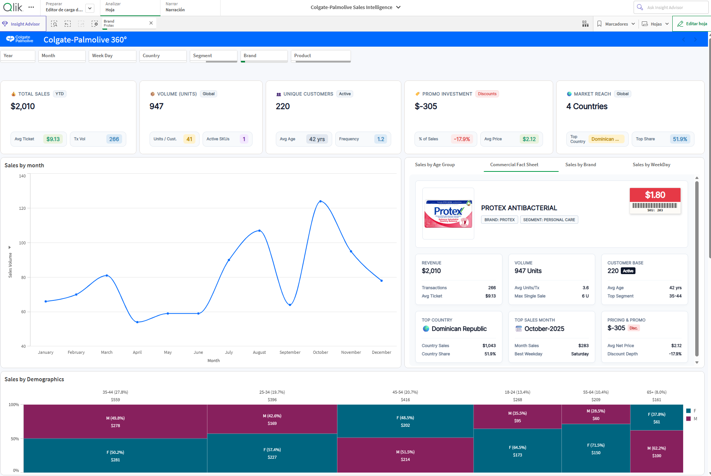
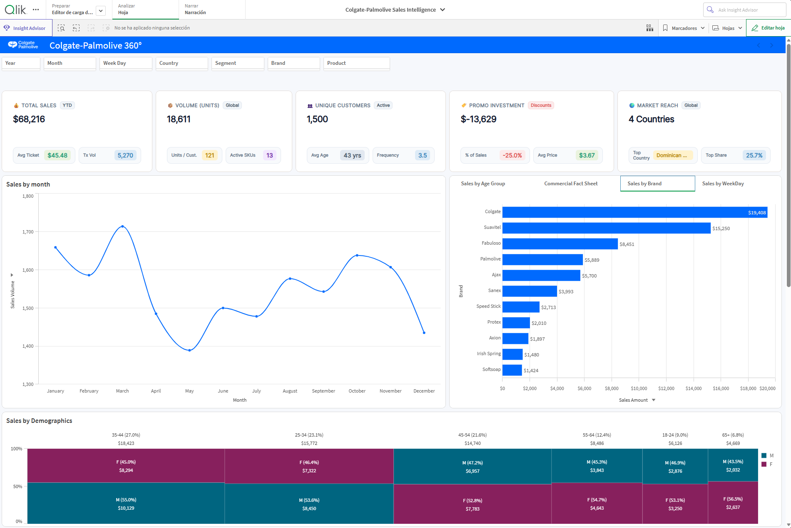
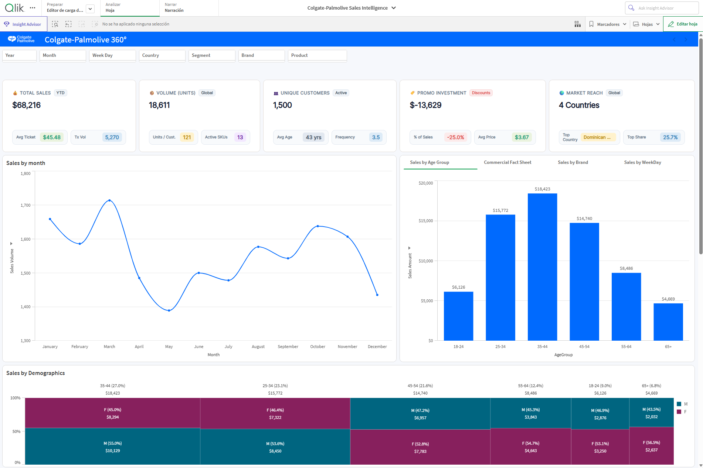
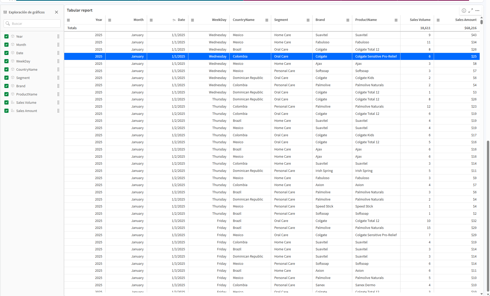

# Colgate-Palmolive 360° — CPG Regional Commercial Performance

**A simulated sales intelligence dashboard built in Qlik Sense, analyzing commercial performance across four Latin American markets.**



---

## 📋 Table of Contents

- [Project Overview](#project-overview)
- [Business Objective](#business-objective)
- [Data Architecture](#data-architecture)
- [Dynamic Master Calendar](#dynamic-master-calendar)
- [Dynamic Customer Segmentation](#dynamic-customer-segmentation)
- [Dashboard Experience](#dashboard-experience)
- [KPI Ecosystem](#kpi-ecosystem)
- [Sales Trend Analysis](#sales-trend-analysis)
- [Commercial Fact Sheet](#commercial-fact-sheet)
- [Brand Performance](#brand-performance)
- [Demographic Analysis](#demographic-analysis)
- [Weekday Analysis](#weekday-analysis)
- [Transaction-Level Analysis](#transaction-level-analysis)
- [UI/UX Design](#uiux-design)
- [Robustness & Technical Philosophy](#robustness--technical-philosophy)
- [From Data to Business Insight](#from-data-to-business-insight)
- [Repository Structure](#repository-structure)
- [How to Open the App](#how-to-open-the-app)
- [Tech Stack](#tech-stack)

---

## Project Overview

**CPG Regional Commercial Performance** is a simulated sales intelligence environment developed in Qlik Sense to analyze the commercial performance of a regional consumer goods operation.

The solution consolidates transactional, product, customer, demographic, and geographic data across **four Latin American markets** (Mexico, Brazil, Colombia, and the Dominican Republic), providing a unified view of sales performance and consumer behavior.

The dashboard was designed not only to report results, but to provide an interactive analytical experience where users can move from high-level business KPIs to detailed product, brand, demographic, and transactional analysis.

The project emphasizes **data modeling, analytical logic, visualization, and user experience**, with particular attention to building a robust and scalable solution.

## Business Objective

The main objective is to provide commercial teams with a centralized environment to answer questions such as:

- How are sales performing over time?
- Which countries and brands generate the most revenue?
- Which customer segments contribute the most to sales?
- How does performance vary by age and gender?
- Which products and brands have the highest commercial contribution?
- How frequently are customers purchasing?
- What is the impact of promotional discounts?
- Which days and periods generate higher sales activity?

Rather than presenting isolated metrics, the dashboard connects these dimensions so users can explore the business from multiple perspectives.

## Data Architecture

The solution follows a **Star Schema** architecture, separating descriptive dimensions from the transactional fact table.

### Dimension Tables

| Table | Description |
|---|---|
| `Dim_Country` | Country, country code, and regional information |
| `Dim_Product` | Product, brand, segment, price, and product image |
| `Dim_Customer` | Customer demographics, including age, gender, and country |
| `Calendar` | Dynamically generated date attributes |

### Fact Table

`Fact_Sales` contains the transactional grain of the model, including:

- Sales ID
- Date
- Product ID
- Customer ID
- Country ID
- Units
- Sales Amount

This structure allows the dashboard to perform flexible aggregations while maintaining a clear relationship between commercial transactions and their descriptive attributes.

## Dynamic Master Calendar

One of the key technical decisions was to avoid hard-coded date ranges.

The **Master Calendar** determines the minimum and maximum dates directly from the `Fact_Sales` table and generates the complete date range dynamically. This approach makes the solution more resilient when new historical periods or future data are incorporated.

The calendar provides analytical fields such as:

- Year
- Month
- Day
- Week
- Weekday
- Quarter
- Month-Year
- Month-Year Sort

This also ensures consistent time-based analysis throughout the application.

## Dynamic Customer Segmentation

Customer age groups are generated directly during the backend load process. Customers are automatically classified into:

- 18–24
- 25–34
- 35–44
- 45–54
- 55–64
- 65+

This allows demographic analysis to remain consistent across the entire application without requiring additional manual classification. The same demographic structure feeds the dashboard's visualizations, including the *Sales by Demographics* analysis.

## Dashboard Experience

The main dashboard, branded as **Colgate-Palmolive 360°**, was designed as an interactive commercial intelligence workspace. The interface combines global KPIs, trend analysis, product intelligence, brand performance, customer demographics, and transactional detail within a single analytical environment.

### Global Filters

Users can dynamically filter the entire dashboard by:

- Year
- Month
- Weekday
- Country
- Segment
- Brand
- Product

These selections propagate throughout the application (thanks to Qlik's associative engine), allowing users to move from a regional overview to a highly specific business scenario.

## KPI Ecosystem

The top section contains five primary KPI cards designed to provide an immediate overview of commercial performance:

| KPI | Primary Metric | Supporting Indicators |
|---|---|---|
| **Total Sales** | Overall sales revenue | Average Ticket, Transaction Volume |
| **Volume** | Units sold | Units per Customer, Active SKUs |
| **Unique Customers** | Customer base | Average Age, Purchase Frequency |
| **Promo Investment** | Promotional impact | % of Sales, Average Price |
| **Market Reach** | Regional perspective | Number of Countries, Top Country, Top Country Share |

The KPI structure was intentionally designed to combine a primary business metric with supporting indicators, allowing users to understand not only *what* happened, but also additional context around the result.

## Sales Trend Analysis

The **Sales by Month** visualization provides a twelve-month view of sales volume. The interactive line chart allows users to identify:

- Monthly peaks and declines
- Seasonal patterns
- Changes in sales momentum
- The effect of applied filters

Because Qlik Sense selections are associative, filtering a country, brand, segment, or product immediately changes the trend analysis. For example, selecting **Fabuloso** transforms the dashboard from a regional overview into a product-specific commercial analysis.



## Commercial Fact Sheet

The **Commercial Fact Sheet** is designed as a detailed product profile. When a single product is selected, the module dynamically displays:

- Product image
- Brand
- Segment
- SKU
- Price
- Revenue
- Sales volume
- Customer base
- Transactions
- Average ticket
- Average units per transaction
- Maximum single sale
- Top country
- Top sales month
- Pricing and promotional information

This creates a bridge between traditional dashboard analysis and a more detailed SKU-level commercial dossier. The component also includes a controlled empty state when a unique product selection has not been made, preventing unnecessary visual clutter.



## Brand Performance

The **Sales by Brand** view provides a horizontal comparison of the brands within the portfolio, allowing commercial users to quickly identify differences in sales contribution across brands such as:

Colgate · Suavitel · Fabuloso · Palmolive · Ajax · Sanex · Speed Stick · Protex · Axion · Irish Spring · Softsoap

The visualization is fully interactive, meaning that selecting a brand updates the rest of the dashboard accordingly.



## Demographic Analysis

The **Sales by Demographics** section combines age groups and gender into a single visual analysis, providing two levels of information:

- Total sales contribution by age group
- Gender composition within each age group

This makes it possible to understand both the size of each demographic segment and its internal composition. For example, the dashboard can show how the 35–44 segment contributes to overall sales while simultaneously displaying the distribution between male and female customers — a more granular perspective than a conventional demographic table.



## Weekday Analysis

The **Sales by Weekday** view provides a distribution of sales across the days of the week. The donut visualization makes it possible to identify how evenly commercial activity is distributed between Monday and Sunday — useful for understanding purchasing patterns and identifying potential differences in customer behavior throughout the week.

## Transaction-Level Analysis

A detailed tabular view was also incorporated to expose the underlying transactional structure behind the dashboard, with fields such as:

Year · Month · Date · Weekday · Country · Segment · Brand · Product · Sales Volume · Sales Amount

This layer provides transparency into the data behind the aggregated visualizations and allows users to validate individual transactions and analytical results.



## UI/UX Design

A significant part of the project focused on extending the standard Qlik Sense interface through **HTML and CSS embedded directly into expressions**. This approach was used to create:

- Custom KPI cards
- Responsive information containers
- Product profile layouts
- Custom badges
- Pricing components
- Visual hierarchy
- Empty states
- Micro-level supporting metrics

The objective was to maintain the analytical power of Qlik Sense while creating a more polished, application-like user experience. The visual language uses a clean commercial design with strong use of white space, subtle borders, compact information cards, and the Colgate-Palmolive visual identity.

## Robustness & Technical Philosophy

A central principle of the project was to build a solution that remains reliable under different user selections and data scenarios. Expressions were designed to account for edge cases such as:

- Division by zero
- No available selections
- Multiple selections
- Single-product selections
- Dynamic data ranges
- Empty analytical states

For example, KPI calculations use conditional logic to prevent invalid calculations when there are no customers or transactions available in the current selection context. The result is a dashboard that is not dependent on a single predefined scenario, but can adapt to different analytical questions.

## From Data to Business Insight

The project follows a complete BI workflow:

```
Raw Data → Data Model → Business Logic → KPIs → Interactive Analysis → Commercial Insight
```

The backend establishes the data foundation, while the frontend transforms that foundation into an interactive commercial intelligence experience. The final result is a Qlik Sense application that combines **data engineering, business intelligence, analytical storytelling, and custom UI development** within a single regional CPG use case.

---

## Repository Structure

```
.
├── README.md
├── Colgate-Palmolive_Sales_Intelligence.qvf   # Qlik Sense app (open with Qlik Sense Desktop)
└── docs/
    └── screenshots/
        ├── sales-by-weekday.png
        ├── commercial-fact-sheet-fabuloso.png
        ├── commercial-fact-sheet-protex.png
        ├── sales-by-brand.png
        ├── sales-by-age-group.png
        └── transaction-level-table.png
```

## How to Open the App

1. Install [Qlik Sense Desktop](https://www.qlik.com/us/products/qlik-sense/desktop) (free) or use a Qlik Sense Enterprise/Cloud environment.
2. Clone this repository:
   ```bash
   git clone https://github.com/josegr88/Qlik-Colgate.git
   ```
3. Open `Colgate-Palmolive_Sales_Intelligence.qvf` with Qlik Sense Desktop.
4. Reload the data model if prompted (`Ctrl+R` or the reload button in the Data Load Editor) to regenerate the Master Calendar and segmentation fields.

## Tech Stack

- **Qlik Sense** — data modeling, scripting (Data Load Editor), and visualization engine
- **Qlik Set Analysis & Expressions** — KPI logic and conditional calculations
- **HTML/CSS (embedded in expressions)** — custom UI components
- **Star Schema** — dimensional data modeling

---

### Author

Simulated CPG analytics project built to demonstrate end-to-end BI development: data modeling, business logic, and custom dashboard UX in Qlik Sense.
